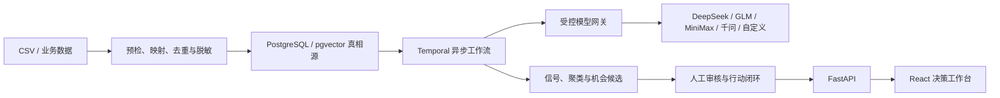

# BearVoice Insights｜客户原声驱动的产品机会决策平台

BearVoice 把分散的客服原声转成可追溯、可审核、可执行的产品改进决策。系统不是只生成一份分析报告，而是贯通数据接入、清洗去重、AI 多信号抽取、风险优先洞察、产品机会审核、行动分派和效果复盘。

> 路演评审建议先读：[官方评审指南](docs/ROADSHOW.md) → [平台启动与部署](platform/README.md) → [产品决策工作流](platform/docs/operations/product-decision-insight-workflow.md)。

## 为什么有商业价值

- **安全问题不会被低声量淹没**：critical/high 风险先进入人工复核，不用声量单独决定优先级。
- **洞察能回到证据**：信号、聚类、机会和行动均可追溯到脱敏原声与分析运行版本。
- **AI 不替企业越权决策**：根因、改进方向和 ROI 均有明确边界，立项、召回和收益承诺必须由具名负责人审批。
- **从发现问题走到改善闭环**：机会可以创建负责人、协作人、目标、截止时间和结果指标，人工记录效果与局限。
- **可私有化部署**：应用、数据库、对象存储、工作流和模型出口均由企业环境控制。

## 已实现的端到端能力

| 环节 | 当前能力 |
|---|---|
| 数据接入 | CSV 内存预检、编码识别、字段映射、重复/模板噪声识别、隔离原因 |
| 数据治理 | 去重、隐私脱敏、业务字段保留、批次与内容哈希溯源 |
| AI 分析 | DeepSeek、GLM、MiniMax、通义千问及自定义 OpenAI-compatible 模型入口 |
| 稳定运行 | Temporal 异步批处理、并发控制、指数退避、逐条检查点、硬预算上限 |
| 深度洞察 | 生命周期、问题、场景、潜在需求、风险、根因假设、改进方向、验证计划 |
| 产品决策 | 多维切片、关键模式、Top 决策卡、证据边界、禁止结论和人工责任人 |
| 行动闭环 | 机会审核、行动状态机、负责人/协作人、结果指标与人工复盘 |
| 企业治理 | 权限与产品范围、append-only 审计、黄金样本、模型发布门禁与回滚 |

## 经验证的路演快照

2026-08-15 使用 DeepSeek V4 Pro 对养生壶数据完成了一次受控批量分析：

- 370/370 条记录完成，370 条逐条检查点，未解析 0 条；
- 363 条去重原声、537 个多维信号、126 个候选聚类、126 个待审核机会；
- 风险信号包含 critical 6、high 54、medium 127、low 350；
- “底座冒烟并伴随烧塑料味”被提升为 critical，并进入 P0 人工复核；
- 时间范围只有 4 天、来源只有天猫，系统明确禁止趋势、市场外推、因果和 ROI 结论。

这组数字是本机数据库中的已验证运行快照，不包含 API Key，也不把客户原声数据库提交到 Git。全新克隆默认使用 0 次外部调用的本地规则基线；只有管理员显式批准模型、用途、HTTPS 端点和预算后才会外发脱敏载荷。

## 系统架构



技术栈：React + TypeScript + Vite、FastAPI + SQLAlchemy + Alembic、PostgreSQL/pgvector、Temporal、Valkey、Docker Compose、Nginx 同源代理。

## 一键本地演示

前提：Docker Desktop。

```bash
cd platform
bash scripts/demo-up.sh
```

打开 `http://localhost:4173`，点击“进入本地开发环境”。API 文档位于 `http://localhost:8000/api/docs`，Temporal UI 位于 `http://localhost:8233`。

本地开发登录只允许 localhost，使用短期 HttpOnly、SameSite Cookie；生产环境必须关闭该入口并接入企业 OIDC。

## 当前验证证据

- 后端：80 项测试通过，Ruff 通过；
- 前端：9 项测试通过，TypeScript 与 Vite 生产构建通过；
- 真实 Compose：3 条浏览器测试通过，不拦截或模拟 API；
- API、Web、Worker 健康，Alembic 为 `0007 (head)`；
- 密钥仅从被 Git 忽略的 `.env` 读取，安全 provider API 不返回 key 或 base URL。

## 文档入口

- [路演官方评审指南](docs/ROADSHOW.md)
- [平台启动、配置、备份与部署](platform/README.md)
- [受控 AI 原声洞察工作流](platform/docs/operations/ai-semantic-workflow.md)
- [产品决策洞察工作流](platform/docs/operations/product-decision-insight-workflow.md)
- [中国模型 API 接入依据](platform/backend/docs/china-model-api-sources.md)
- [企业架构审查](docs/reviews/001-enterprise-architecture.md)
- [当前状态板](state/board.md)

## 生产边界

当前版本已经具备可运行的企业纵向链路，但正式生产仍需企业提供 OIDC、生产对象存储、网络出口策略、Temporal mTLS/命名空间权限、数据保留策略和业务系统集成。仓库不应被理解为已经完成这些企业侧接入，也不应把 AI 候选洞察视为质量定性、召回或投资收益结论。
